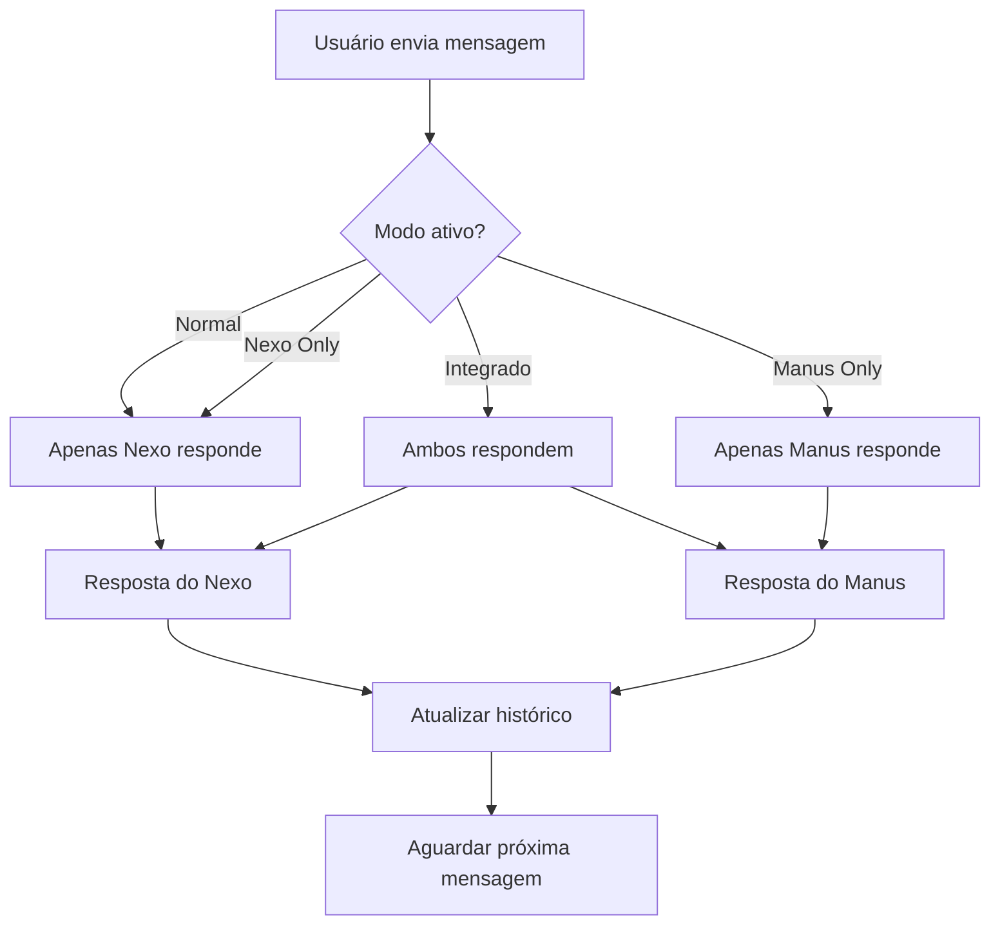

# Sistema de Comunicação Integrada
## Manus + Nexo + Usuário via Telegram

### 🌐 Visão Geral

O Sistema de Comunicação Integrada permite que você converse simultaneamente com:
- **🤖 Manus** - Assistente de IA geral da plataforma Manus
- **🔷 Nexo** - Seu agente autônomo especializado
- **👤 Você** - Controle total da conversa

### 🚀 Funcionalidades

#### 🔄 Modos de Conversa
1. **Normal** - Apenas Nexo responde (padrão)
2. **Integrado** - Ambos os agentes respondem
3. **Nexo Only** - Apenas Nexo responde
4. **Manus Only** - Apenas Manus responde

#### 🎛️ Controles Disponíveis
- **Ativação/Desativação** individual de agentes
- **Histórico persistente** de conversas
- **Contexto compartilhado** entre agentes
- **Modo de operação** flexível

### 📱 Comandos do Telegram

#### Comandos Básicos
```
/start - Iniciar sistema integrado
/help - Mostrar ajuda completa
/status - Ver status do sistema
```

#### Gerenciamento de Conversa
```
/mode - Alterar modo de conversa
/agents - Ativar/desativar agentes
/history - Ver histórico recente
/clear - Limpar histórico
```

### 🔧 Configuração

#### Variáveis de Ambiente Necessárias
```bash
TELEGRAM_BOT_TOKEN=seu_token_do_botfather
NEXO_URL=https://nexo-kh57.onrender.com
MANUS_API_URL=https://api.manus.im
MANUS_API_KEY=sua_chave_manus (opcional)
```

#### Usuário Autorizado
- **Chat ID:** 8016202357 (seu ID)
- Apenas você tem acesso ao sistema

### 🎯 Como Usar

#### 1. Iniciar o Sistema
```bash
python run_integrated_system.py
```

#### 2. Configurar Modo
1. Envie `/mode` no Telegram
2. Escolha o modo desejado:
   - 🔹 Normal
   - 🌐 Integrado
   - 🔷 Nexo Only
   - 🤖 Manus Only

#### 3. Conversar
- Envie qualquer mensagem
- Receba respostas dos agentes ativos
- Continue a conversa naturalmente

### 💡 Exemplos de Uso

#### Modo Integrado
```
Você: "Analise o mercado de IA em 2024"

🔷 Nexo: [Análise técnica detalhada com dados específicos]

🤖 Manus: [Análise estratégica com insights de mercado]
```

#### Comparação de Respostas
```
Você: "Como automatizar vendas?"

🔷 Nexo: [Foco em implementação técnica]

🤖 Manus: [Foco em estratégia e processo]
```

### 🔍 Capacidades dos Agentes

#### 🔷 Nexo (Seu Agente Autônomo)
- ✅ Conhece seu contexto específico
- ✅ Acesso ao sistema EcoGuardians
- ✅ Integração com Supabase
- ✅ Operação autônoma
- ✅ Memória de longo prazo

#### 🤖 Manus (Assistente Geral)
- ✅ Análise e pesquisa avançada
- ✅ Criação de conteúdo
- ✅ Automação de processos
- ✅ Integração de sistemas
- ✅ Planejamento estratégico

### 🔄 Fluxo de Comunicação



### 🛡️ Segurança

#### Controle de Acesso
- Apenas seu Chat ID tem acesso
- Verificação em cada comando
- Logs de todas as interações

#### Privacidade
- Conversas não são armazenadas permanentemente
- Contexto mantido apenas em memória
- Histórico limitado às últimas mensagens

### 📊 Monitoramento

#### Status do Sistema
```
/status - Mostra:
- Modo atual de conversa
- Agentes ativos/inativos
- Número de mensagens no histórico
- Última atividade
```

#### Logs Disponíveis
- Interações com agentes
- Erros de comunicação
- Mudanças de configuração
- Status de conectividade

### 🔧 Troubleshooting

#### Bot não responde
1. Verifique `TELEGRAM_BOT_TOKEN`
2. Confirme que o serviço está rodando
3. Teste com `/status`

#### Agente não responde
1. Verifique conectividade com APIs
2. Confirme configuração de URLs
3. Teste agentes individualmente

#### Erro de autorização
1. Confirme seu Chat ID: 8016202357
2. Verifique se está usando o bot correto
3. Reinicie o sistema se necessário

### 🚀 Próximas Melhorias

#### Funcionalidades Planejadas
- [ ] Integração real com API do Manus
- [ ] Persistência de histórico no Supabase
- [ ] Comandos específicos por agente
- [ ] Métricas de uso e performance
- [ ] Notificações proativas

#### Integrações Futuras
- [ ] Google Calendar para agendamentos
- [ ] Gmail para comunicação
- [ ] GitHub para desenvolvimento
- [ ] APIs de terceiros conforme necessário

### 📞 Suporte

Para problemas ou dúvidas:
1. Verifique logs do sistema
2. Teste conectividade com `/status`
3. Reinicie o sistema se necessário
4. Consulte documentação técnica

---

**🎯 Objetivo:** Criar um ambiente de comunicação eficiente onde você pode aproveitar as capacidades complementares do Manus e do Nexo simultaneamente, otimizando produtividade e resultados.
